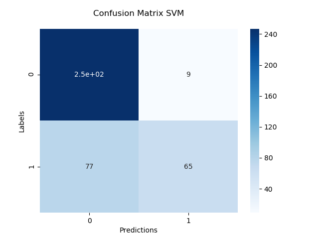
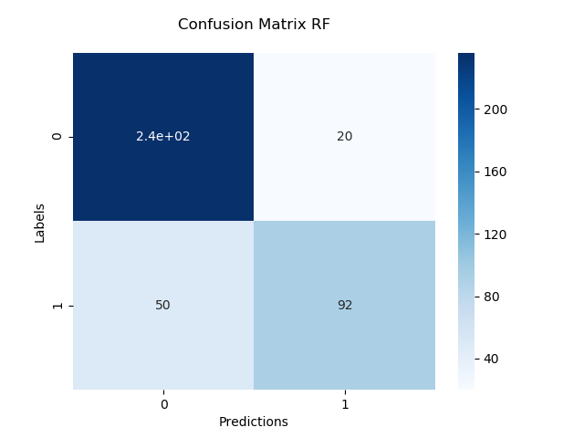
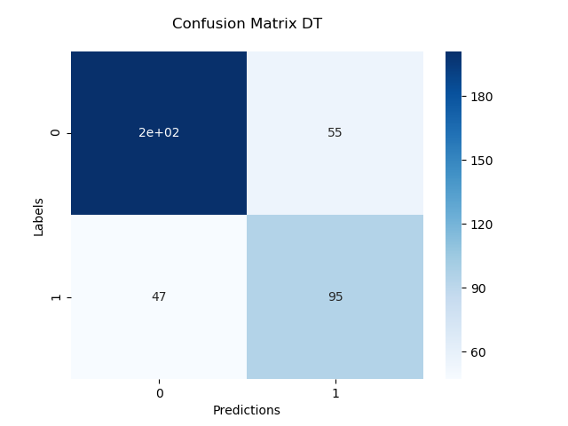

# Travel Insurance Prediction

## About

The main goal of this project is to predict if a customer of some travel agency will buy the new travel insurance package or not.

### Dataset
For this project a [public dataset](https://www.kaggle.com/datasets/tejashvi14/travel-insurance-prediction-data) from Kaggle was used.

### Implementation
The code was implemented in python using pandas, numpy, scikit-learn, matplotlib and seaborn libraries. Also, some preprocessing of the data was needed: categorical objects were transform into numerical objects and unnecessary variables were dropped. For the prediction 3 methods were used: Decision Tree, Support Vector Machine, Random Forest.

### Summary
`Main.py`: file that trains the model based on users choice, prints and plots the model's result.

`PreProcess.py`: file where the dataset is preprocessed and splitted into train and test.

`SVM.py`: file where the svm algorithm is implemented, trained and tested.

`RF.py`: file where the rf algorithm is implemented, trained and tested.

`DT.py`: file where the dt algorithm is implemented, trained and tested.

`Report.py`: file where the test and result report is implemented.

## How To
The python version used in this project was:
```
    Python 3.7.3
```

First you will need to install the following dependencies:
``` pip install numpy
    pip install pandas
    pip install scikit-learn
    pip install seaborn
    pip install matplotlib
```
Once the dependencies were installed to run the code go to the root of this repository and execute the command below:
``` 
    python Main.py
```
Also, when running the Main.py file, is possible to fit some methods' parameters. To do so choose at least one of the following flags defining the desired value:

`--model`: Choose which model you want to use (`all`, `svm`, `rf`, `tree`).

`--kernel`: Choose which svm kernel you want to use. To see the options check the scikit-learn [docs](https://scikit-learn.org/stable/modules/generated/sklearn.svm.SVC.html).

`--criterion`: Choose which decision tree/random forest criterion you wanna use. To see the options check the scikit-learn [docs](https://scikit-learn.org/stable/modules/generated/sklearn.tree.DecisionTreeClassifier.html).

`--max_depth`: Choose the maximum depth of the decision tree/random forest.

## Results
<div align="center">



</div>
